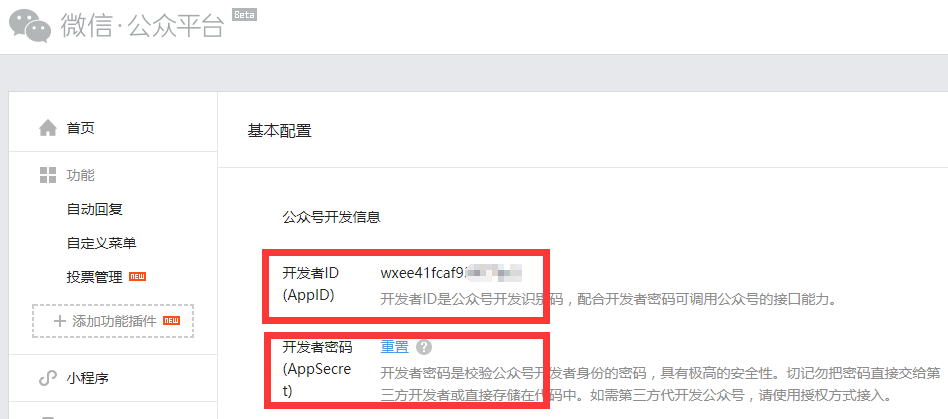
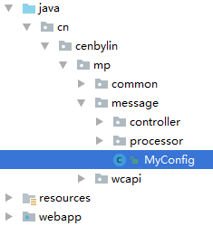
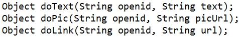
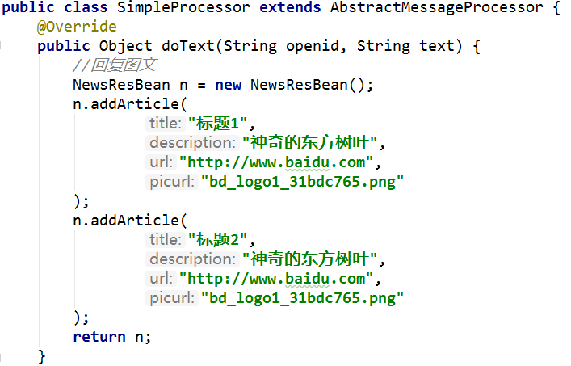
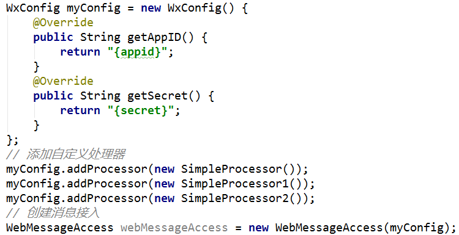
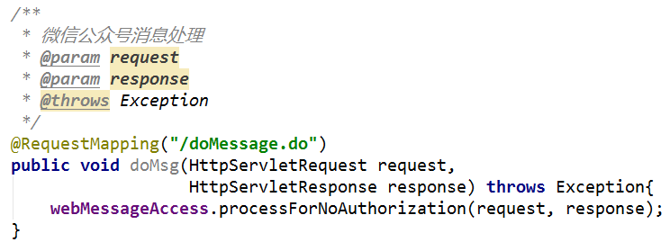
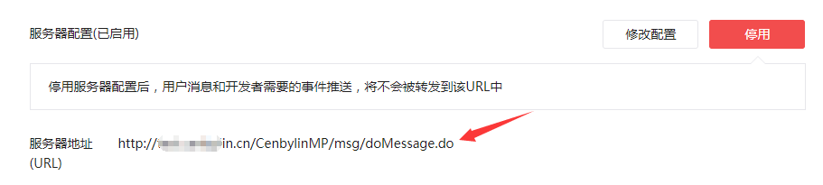

# WxMessageSDK 轻量的微信公众号消息处理SDK
> 简化和微信服务器交互的繁琐部分

## 快速开始

本SDK所做大部分工作仅仅是封装了微信文档的开发工作，为了保证拓展性，安装和使用是非常简单的。
### 0. 安装
将SDK的jar包添加到你的classpath，下载地址：
如果你使用 Maven，你只需要在 pom.xml 中添加下面的依赖：
```xml
<dependency>
	<groupId>com.github.cenbylin</groupId>
    <artifactId>WxMessageSDK</artifactId>
	<version>最新版本</version>
</dependency>
```
### 1. 获取你的公众号开发配置
请自行去微信公众平台获取你的appid和secret

### 2. 创建配置
创建一个继承WxConig类的MyConfig类，并把appid和secret写在覆盖的方法里

```java
import com.github.cenbylin.wxmessage.sdk.dev.WxConfig;
/**
 * MyConfig.java
 */
public class MyConfig extends WxConfig {
    public String getAppID() {
        return "{你的appid}";
    }
    public String getSecret() {
        return "{你的secret}";
    }
}
```
### 3.编写处理器代码
继承AbstractMessageProcessor即可，可以选择覆盖如下几个方法：

当接收了微信消息，会调用相应的这些方法；返回值对应了不同的微信回复内容。

| 返回类型 | 回复 |
|--------|--------|
|String|文本|
|NewsResBean|图文|
|ImageResBean|图片|
**示例**

**详细示例见 example/processorExam.java**
### 4. 实例化接入对象
#### 4.1 集成spring方式（推荐）
只需要在applicationContext.xml中增加如下配置：
```xml
<!-- 配置 -->
<bean id="wxconfig" class="cn.cenbylin.mp.message.MyConfig"/>
<!-- 消息接入的对象 -->
<bean class="com.github.cenbylin.wxmessage.sdk.web.WebMessageAccess">
    <constructor-arg ref="wxconfig"/>
</bean>
<!-- BeanPostPrcessor -->
<bean class="com.github.cenbylin.wxmessage.sdk.support.MsgBeanPostPrcessorImpl">
    <constructor-arg ref="wxconfig"/>
</bean>
<!-- 消息拦截器包扫描 -->
<context:component-scan base-package="cn.cenbylin.mp.message.processor" />
```
#### 4.2 普通模式
同样地生成消息接入的WebMessageAccess对象，不过这个实例需要自行管理

### 5. 接入
不管是用servlet还是springmvc等方式，只需要在微信消息处理的地方托管WebMessageAccess

### 6. 在微信公众平台做接入配置

